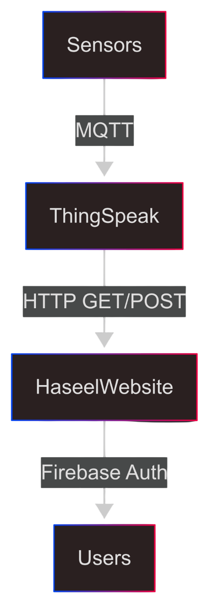
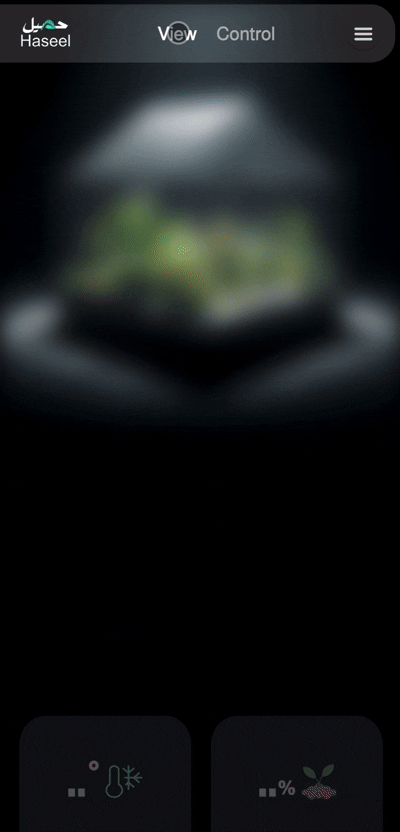
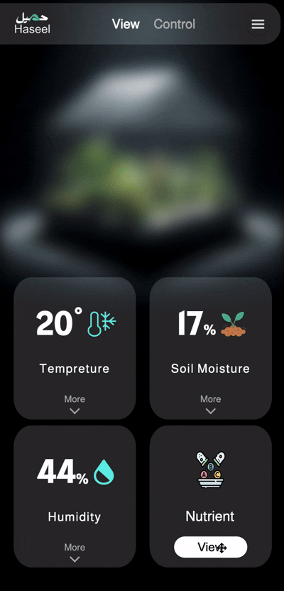
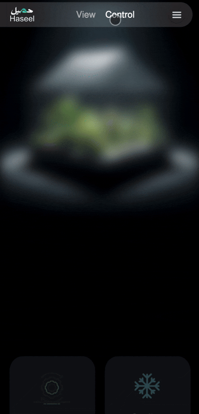
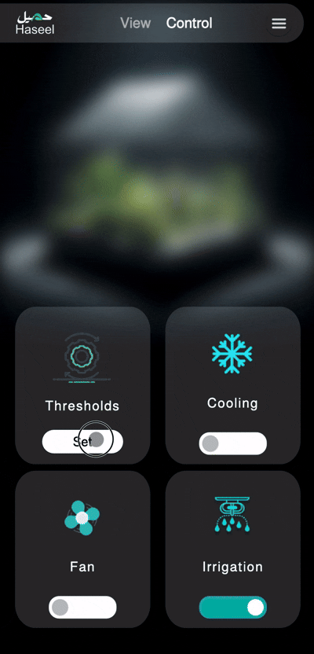
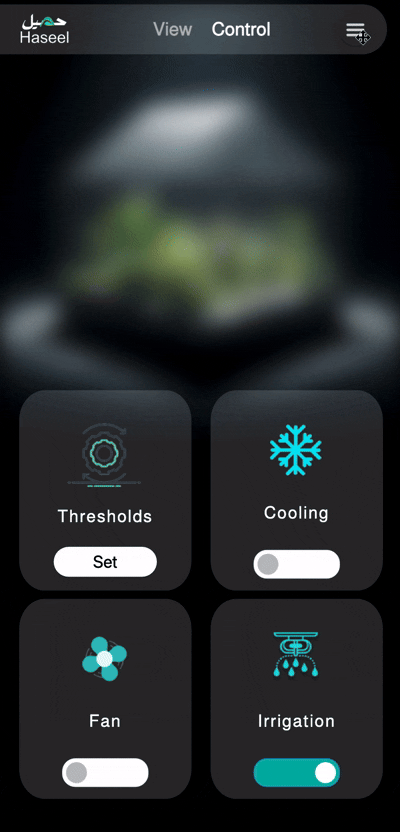

#  Haseel Website
<div align="center">
  
</div>


## 📖 Description
Haseel automates greenhouse farming with IoT precision. Our system monitors temperature, humidity, soil moisture, and nutrients in real-time, while intelligently controlling cooling, irrigation, and ventilation. Set your ideal thresholds once, and let SmartFarm maintain perfect growing conditions automatically - or take manual control anytime from our mobile-friendly dashboard. Grow smarter with 24/7 precision care for your plants.
<br>
<br>

## 🛠️ Technical Implementation
### 🔌 Connection Protocol 

<div align="center">
  
</div>


### 🔑 Core Integration Code
1- ThingSpeak Integration:
``` JavaScript
const thingSpeakAPIKey = 'Your ThingSpeak API Key';
const channelID = 'Your Channel ID';
```

2- Data Fetching from ThingSpeak:
``` JavaScript
function getRealTimeData(realTimeData, field) {
    var url = "https://api.thingspeak.com/channels/" + channelID + "/fields/" + field + "/last.json";

    $.getJSON(url, function (data) {
        var value = data["field" + field];
        if (value < 1000) {
            $(realTimeData).text(value);
        }
    });
}
```
<br>

### 🖥️  Haseel Website Interfaces 
#### View Page:
Monitor real-time sensor data and explore historical data with graphs.  
<div align="center">
   &nbsp;&nbsp;&nbsp;&nbsp;
  
</div>
<br>

#### Control Page:
Manually adjust toggle switches or set threshold values to configure automation rules. 
<div align="center">
   &nbsp;&nbsp;&nbsp;&nbsp;
  
</div>
<br>
  
#### Settings Page:
Enable/disable automation features and configure system preferences. 
<div align="center">
   
</div>
<br>

### 📝 Production Notes
- Replace channelID and API keys with environment variables.
- Enable Firebase Email/Password auth with authorisation.
- Set up ThingSpeak rate limiting (15 sec/update free tier).
<br>

## 🛎️ Current Limitations
| Area | Constraint | Improvement Path |
|----------|----------|----------|
| Authentication   | Basic Firebase (No RBAC)     | Implement role-based access     |
| Responsiveness   | Optimized for mobile only     | Tablet/desktop layouts     |
| Data Pipeline   | ThingSpeak free tier limits     | Migrate to AWS IoT/Azure     |
<br>

## 🚀 Future Work
- Applying better mechanism for accessing APIs and storing keys.
- Improving the automation mechanism by creating a database that stores thresholds of the measured factors for all kinds of plant.
- Applying visual monitoring by adding cameras at the farm.
  - Implmenting ML model for detecting plant diseases.


